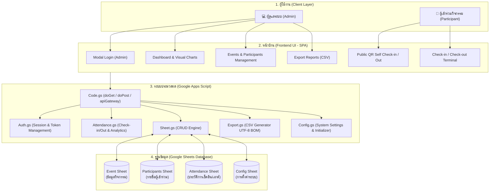

# สรุปโครงสร้างและสถาปัตยกรรมระบบ (System Architecture & Technical Summary)
## ระบบลงทะเบียนและการเข้าร่วมการประชุม อบรม สัมมนา (Check-in / Check-out By Watpon NAN1)

> **ผู้พัฒนา**: Watpon NAN1  
> **เวอร์ชันระบบ**: 1.0.0  
> **แพลตฟอร์มหลัก**: Google Apps Script (GAS) + Google Sheets Database + Web App (Responsive SPA)

---

## 1. ภาพรวมระบบ (System Overview)

**ระบบ Check-in / Check-out By Watpon NAN1** พัฒนาขึ้นเพื่อบริหารจัดการการลงทะเบียน การบันทึกเวลาเข้าร่วม (Check-in) และเวลาเสร็จสิ้น (Check-out) สำหรับงานประชุม อบรม และสัมมนาของหน่วยงานทางการศึกษาและองค์กรทั่วไป รองรับการทำงานแบบไร้กระดาษ (Paperless) ลดภาระงานของเจ้าหน้าที่ผู้จัดงาน และอำนวยความสะดวกแก่ผู้เข้าร่วมกิจกรรม

### จุดเด่นสำคัญ (Key Highlights)
1. **Multi-Event Support**: รองรับการสร้างและจัดการหลายกิจกรรมพร้อมกัน สามารถเปิด/ปิดรับลงทะเบียนแยกรายกิจกรรมได้
2. **ระบบสแกนและค้นหาที่ยืดหยุ่น**:
   - ค้นหาด้วยชื่อ-นามสกุล
   - ค้นหาด้วยเบอร์โทรศัพท์
   - ค้นหาด้วยรหัสผู้เข้าร่วม (PID)
   - สแกน QR Code ประจำตัวผู้เข้าร่วม หรือสแกน QR Code ประจำงานด้วยสมาร์ตโฟน
3. **Public Self-Service Registration & Check-in**: ผู้เข้าร่วมสามารถสแกน QR Code หน้างานเพื่อลงทะเบียนและเช็คอินได้ด้วยตนเองผ่านมือถือ
4. **Public Check-out with Profile Verification**: รองรับการตรวจสอบข้อมูลและกด Check-out ด้วยตนเองก่อนเดินทางกลับ
5. **Batch Check-out**: ฟังก์ชันสำหรับแอดมินในการเช็คเอาต์ผู้เข้าร่วมพร้อมกันหลายคนหรือทั้งกิจกรรมในคลิกเดียว
6. **Device & Geolocation Tracking**: บันทึกข้อมูลพิกัด GPS (Latitude, Longitude), ชนิดอุปกรณ์ (Device) และเว็บเบราว์เซอร์ เพื่อความโปร่งใสและตรวจสอบได้
7. **Real-time Analytics Dashboard**: แดชบอร์ดสรุปสถิติผู้เข้าร่วม อัตราการเข้าร่วม (Attendance Rate) กราฟแสดงสถิติรายชั่วโมง และสัดส่วนตามหน่วยงาน/สังกัด ด้วย Google Charts
8. **Government Receipt Export (CSV UTF-8 BOM)**: ส่งออกรายงานการลงนามรับเงินค่าพาหนะ/เบี้ยเลี้ยงตามแบบฟอร์มมาตรฐานของหน่วยงานราชการ พร้อมเปิดใน Microsoft Excel ภาษาไทยได้ทันทีโดยไม่เพี้ยน

---

## 2. ผังการทำงานและสถาปัตยกรรมระบบ (Architecture Flow)



---

## 3. โครงสร้างฐานข้อมูล (Database Schema)

ระบบใช้ Google Sheets เป็นฐานข้อมูลเชิงสัมพันธ์แบบ NoSQL/Tabular โดยแบ่งออกเป็น 4 ตาราง (Sheets) หลัก:

### 3.1 Sheet: `Event` (ตารางกิจกรรม)
จัดเก็บข้อมูลกิจกรรมการประชุม อบรม และสัมมนาทั้งหมด

| Column | Field Name | Data Type | Description |
| :---: | :--- | :--- | :--- |
| A | `EventID` | String | รหัสกิจกรรมหลัก เช่น `EVT20260703140522001` (Primary Key) |
| B | `EventName` | String | ชื่อกิจกรรมหรือโครงการ |
| C | `Date` | String | วันที่จัดกิจกรรม (รูปแบบ `dd/MM/yyyy`) |
| D | `StartTime` | String | เวลาเริ่มต้นกิจกรรม (เช่น `08:30:00`) |
| E | `EndTime` | String | เวลาสิ้นสุดกิจกรรม (เช่น `16:30:00`) |
| F | `Location` | String | สถานที่จัดงาน / ห้องประชุม |
| G | `Description` | String | รายละเอียดหรือกำหนดการสังเขป |
| H | `QRCodeToken` | String | UUID Token ประจำกิจกรรม ใช้สำหรับสร้าง QR Code |
| I | `CreatedAt` | DateTime | วันที่และเวลาที่สร้างข้อมูล |
| J | `Status` | String | สถานะกิจกรรม (`active`, `closed`, `deleted`) |

---

### 3.2 Sheet: `Participants` (ตารางผู้เข้าร่วม)
จัดเก็บทะเบียนประวัติผู้เข้าร่วมประชุมหรือสัมมนา

| Column | Field Name | Data Type | Description |
| :---: | :--- | :--- | :--- |
| A | `PID` | String | รหัสประจำตัวผู้เข้าร่วม เช่น `PID20260703140522002` (Primary Key) |
| B | `Title` | String | คำนำหน้าชื่อ (นาย, นาง, นางสาว, ดร. ฯลฯ) |
| C | `FirstName` | String | ชื่อ |
| D | `LastName` | String | นามสกุล |
| E | `Organization` | String | หน่วยงาน / โรงเรียน / สังกัด |
| F | `Position` | String | ตำแหน่ง |
| G | `Email` | String | ที่อยู่อีเมล |
| H | `Phone` | String | เบอร์โทรศัพท์สำหรับติดต่อและค้นหา |
| I | `CreatedAt` | DateTime | วันที่และเวลาที่บันทึกข้อมูล |
| J | `Status` | String | สถานะผู้เข้าร่วม (`active`, `inactive`, `deleted`) |

---

### 3.3 Sheet: `Attendance` (ตารางบันทึกเวลา)
จัดเก็บประวัติการ Check-in และ Check-out ในแต่ละกิจกรรม

| Column | Field Name | Data Type | Description |
| :---: | :--- | :--- | :--- |
| A | `PID` | String | รหัสผู้เข้าร่วม (Foreign Key -> Participants) |
| B | `EventID` | String | รหัสกิจกรรม (Foreign Key -> Event) |
| C | `CheckInTime` | DateTime | วันเวลาที่ทำการ Check-in |
| D | `CheckOutTime` | DateTime | วันเวลาที่ทำการ Check-out (ว่างหากยังไม่ Check-out) |
| E | `Latitude` | String/Number | พิกัดละติจูดขณะ Check-in |
| F | `Longitude` | String/Number | พิกัดลองจิจูดขณะ Check-in |
| G | `Browser` | String | ชื่อเว็บเบราว์เซอร์ที่ใช้งาน |
| H | `Device` | String | ชนิดของอุปกรณ์ที่ใช้งาน (เช่น iPhone, Android, PC) |
| I | `IP` | String | IP Address |
| J | `Status` | String | สถานะการเข้าร่วม (`checked-in`, `checked-out`) |
| K | `Remark` | String | หมายเหตุเพิ่มเติม |
| L | `Duration` | String | ระยะเวลาการเข้าร่วมทั้งหมด (คำนวณอัตโนมัติเมื่อ Check-out) |

---

### 3.4 Sheet: `Config` (ตารางตั้งค่าระบบ)
จัดเก็บพารามิเตอร์การตั้งค่าส่วนกลางของระบบ

| Column | Field Name | Description | Default Value |
| :---: | :--- | :--- | :--- |
| A | `Key` | ชื่อคีย์การตั้งค่า | `SYSTEM_NAME`, `ADMIN_USERNAME`, ฯลฯ |
| B | `Value` | ค่าที่ตั้งไว้ | ค่าข้อความหรือตัวเลข |
| C | `Description` | คำอธิบายการใช้งาน | ข้อความอธิบาย |
| D | `UpdatedAt` | วันเวลาที่มีการแก้ไขล่าสุด | Timestamp |

---

## 4. โครงสร้างไฟล์ในโปรเจกต์ (File Organization)

```
Check-in-out By Watpon NAN1/
├── Config.gs               # ค่าคงที่, สคีมาตารางเริ่มต้น, ฟังก์ชัน init, จัดการวันที่
├── Auth.gs                 # ระบบ Login, Logout, Session Token ผ่าน PropertiesService
├── Sheet.gs                # CRUD Engine สำหรับ Event, Participants, Attendance, Config
├── Attendance.gs           # ตรรกะ Check-in/Out, QR Validation, ค้นหา, Dashboard Data
├── Export.gs               # สคริปต์แปลงข้อมูลและส่งออกไฟล์ CSV ตาม Template ภาษาไทย
├── Utility.gs              # ฟังก์ชัน Sanitizer, ตรวจสอบ Browser/Device, สร้าง QR URL
├── Code.gs                 # Main Controller (doGet, doPost, apiGateway, View Routing)
│
├── Index.html              # โครงสร้างหลักของหน้าเว็บ (SPA Container, Navbar, Loading)
├── Style.html              # CSS ทั้งหมด (Theme, Dark Mode, Animations, Responsive Layout)
├── Dashboard.html          # หน้าแสดงสถิติและ Google Charts
├── Admin.html              # หน้าจัดการกิจกรรม และจัดการผู้เข้าร่วม (CRUD Modals)
├── Attendance-html.html    # หน้าบันทึก Check-in/Out, QR Scanner, Batch Checkout
├── Export-html.html        # หน้าส่งออกไฟล์รายงานและใบลงนาม
├── Script-html.html        # JavaScript Client-side ควบคุม Event, Callbacks, SweetAlert2
│
├── appsscript.json         # Manifest ของ Google Apps Script (OAuth Scopes, Web App Mode)
├── vercel_index.html       # Standalone Single-file HTML สำหรับ Deploy บน Vercel/Static Host
├── check_syntax.js         # สคริปต์ Node.js สำหรับตรวจสอบ Syntax ของ Client Script
├── merge.ps1               # สคริปต์ PowerShell รวมไฟล์ HTML เป็น Single-page
├── test_endpoint.ps1       # สคริปต์ PowerShell ทดสอบ POST API Endpoint
└── .gitignore              # ไฟล์กำหนดข้อยกเว้นสำหรับ Git
```

---

## 5. รายละเอียด API Gateway และ Action Endpoints

ระบบรองรับการเรียกใช้งานผ่าน 2 ช่องทางหลัก:
1. **Google Apps Script Internal**: ผ่าน `google.script.run.apiGateway(action, data, token)` (ลดปัญหา CORS ใน iFrame)
2. **REST API Endpoint**: ผ่าน HTTP POST ไปยัง Web App URL ด้วย Payload รูปแบบ JSON:
   ```json
   {
     "action": "<ACTION_NAME>",
     "token": "<SESSION_TOKEN>",
     "data": { ... }
   }
   ```

### ตาราง Action Endpoints ทั้งหมด

| หมวดหมู่ | Action | สิทธิ์ที่ต้องการ | คำอธิบาย |
| :--- | :--- | :---: | :--- |
| **Authentication** | `login` | Public | ตรวจสอบชื่อผู้ใช้และรหัสผ่าน พร้อมออก Session Token |
| | `logout` | Session | ยกเลิก Session Token |
| | `validateSession` | Session | ตรวจสอบความถูกต้องและต่ออายุ Session Token |
| | `changePassword` | Session | เปลี่ยนรหัสผ่านของผู้ดูแลระบบ |
| **Events** | `getAllEvents` | Public/Admin | ดึงรายการกิจกรรมทั้งหมดที่ยังไม่ถูกลบ |
| | `getEventByID` | Public/Admin | ดึงข้อมูลกิจกรรมตาม `eventID` |
| | `getEventByQRToken` | Public | ดึงข้อมูลกิจกรรมจาก QR Code Token |
| | `addEvent` | Admin | สร้างกิจกรรมใหม่ พร้อมสร้าง QR Code Token อัตโนมัติ |
| | `updateEvent` | Admin | แก้ไขข้อมูลกิจกรรม |
| | `deleteEvent` | Admin | ลบกิจกรรม (Soft-delete: `deleted`) |
| | `toggleEventStatus` | Admin | สลับสถานะเปิด/ปิดกิจกรรม (`active` <-> `closed`) |
| **Participants** | `getAllParticipants` | Admin | ดึงรายชื่อผู้เข้าร่วมทั้งหมด |
| | `searchParticipants` | Public/Admin | ค้นหาผู้เข้าร่วมจากชื่อ, สังกัด หรือเบอร์โทร |
| | `addParticipant` | Admin | เพิ่มข้อมูลผู้เข้าร่วมรายบุคคล |
| | `updateParticipant` | Admin | อัปเดตข้อมูลผู้เข้าร่วม |
| | `deleteParticipant` | Admin | ลบข้อมูลผู้เข้าร่วม |
| | `importParticipants` | Admin | นำเข้ารายชื่อผู้เข้าร่วมแบบกลุ่มผ่านไฟล์ CSV |
| **Check-in / Out** | `checkIn` | Public/Admin | บันทึกเวลา Check-in พร้อมข้อมูล GPS และอุปกรณ์ |
| | `checkOut` | Public/Admin | บันทึกเวลา Check-out พร้อมคำนวณระยะเวลาอัตโนมัติ |
| | `batchCheckOut` | Admin | เช็คเอาต์ผู้เข้าร่วมพร้อมกันหลายคนหรือทั้งกิจกรรม |
| | `checkInByQR` | Public | เช็คอินอัตโนมัติผ่าน QR Token ประจำกิจกรรม |
| | `registerAndCheckIn` | Public | ลงทะเบียนผู้เข้าร่วมใหม่และเช็คอินทันทีในขั้นตอนเดียว |
| | `searchParticipantForPublicCheckout` | Public | ค้นหาข้อมูลผู้เข้าร่วมเพื่อเตรียมเช็คเอาต์ตนเอง |
| | `updateAndCheckOutPublic` | Public | ตรวจสอบข้อมูล ปรับปรุงประวัติ และยืนยัน Check-out |
| **Analytics & Export** | `getDashboardStats` | Public/Admin | ดึงสถิติภาพรวม, ข้อมูลกราฟรายชั่วโมง และสัดส่วนสังกัด |
| | `getAttendanceByEvent` | Admin | ดึงประวัติการเข้า-ออกของกิจกรรมที่ระบุ |
| | `getFullAttendanceReport` | Admin | ดึงรายงานฉบับสมบูรณ์สำหรับแสดงผลในระบบ |
| | `exportAttendanceCSV` | Admin | สร้างไฟล์ CSV รูปแบบใบลงนามรับเงิน/ค่าพาหนะ |
| | `exportFullReportCSV` | Admin | สร้างไฟล์ CSV รายงานสรุปการเข้าร่วมทั้งหมด |
| **Configuration** | `getSystemConfig` | Public/Admin | อ่านค่าการตั้งค่าระบบปัจจุบัน |
| | `updateSystemConfig` | Admin | บันทึกและปรับปรุงค่าการตั้งค่า |
| | `setupSystem` | Admin | สร้าง Sheet และตั้งค่าเริ่มต้นระบบ (First-time Setup) |
| | `getWebAppUrl` | Public | ดึง URL ของ Web App |
| | `getQRCodeUrl` | Public | ดึง URL และ QR Code Image Generator |

---

## 6. ความปลอดภัยและการจัดการ Session (Security & Session)

1. **Token-based Authentication**:
   - เมื่อ Admin ทำการ Login ผ่าน `login()` ระบบจะสร้าง UUID Token บันทึกใน Google Apps Script `PropertiesService.getScriptProperties()`
   - Session มีกำหนดอายุตาม `SESSION_TIMEOUT` (ค่าเริ่มต้น 60 นาที)
   - มีฟังก์ชัน Auto-refresh ต่ออายุ Session เมื่อมีการใช้งานระบบต่อเนื่อง
2. **Data Sanitization**:
   - ฟังก์ชัน `sanitizeInput()` ใน `Utility.gs` ทำการแปลงอักขระพิเศษเพื่อป้องกันการโจมตีแบบ Cross-Site Scripting (XSS)
3. **Data Integrity & Soft Delete**:
   - กิจกรรมและผู้เข้าร่วมที่ถูกลบ จะถูกเปลี่ยนสถานะเป็น `deleted` เพื่อป้องกันการสูญหายของประวัติการเข้าร่วมในอดีต
4. **Excel Thai Encoding Compatibility**:
   - ในการส่งออกไฟล์ CSV มีการแทรก UTF-8 BOM (`\uFEFF`) นำหน้าข้อมูลเสมอ เพื่อให้เปิดบน Microsoft Excel ในภาษาไทยได้โดยไม่เกิดปัญหาตัวอักษรต่างดาว

---

## 7. คู่มือการติดตั้งและ Deploy ระบบ (Deployment Guide)

### 7.1 ขั้นตอนบน Google Apps Script
1. เปิด [Google Sheets](https://sheets.google.com) ใหม่ หรือใช้ Sheet ที่มีอยู่
2. ไปที่เมนู **ส่วนขยาย (Extensions)** ➔ **Apps Script**
3. สร้างและคัดลอกไฟล์โค้ดตามโครงสร้างของโปรเจกต์:
   - ไฟล์สคริปต์ (`.gs`): `Config.gs`, `Auth.gs`, `Sheet.gs`, `Attendance.gs`, `Export.gs`, `Utility.gs`, `Code.gs`
   - ไฟล์หน้าเว็บ (`.html`): `Index.html`, `Style.html`, `Dashboard.html`, `Admin.html`, `Attendance-html.html`, `Export-html.html`, `Script-html.html`
   - ไฟล์การตั้งค่า: `appsscript.json`
4. ใน `Config.gs` ตรวจสอบหรือใส่ `SPREADSHEET_ID` ให้ตรงกับ Spreadsheet ของท่าน (หากปล่อยว่าง ระบบจะใช้ Spreadsheet ปัจจุบันที่ผูกอยู่)
5. รันฟังก์ชัน `setupSystem()` ใน Apps Script เพื่อสร้าง Sheets และโครงสร้างตารางเริ่มต้นอัตโนมัติ
6. กดปุ่ม **การทำให้ใช้งานได้ (Deploy)** ➔ **การทำให้ใช้งานได้ใหม่ (New deployment)**
   - ชนิด: **เว็บแอป (Web app)**
   - ดำเนินการในฐานะ (Execute as): **ฉัน (Me)**
   - ผู้มีสิทธิ์เข้าถึง (Who has access): **ทุกคน (Anyone)**
7. คัดลอก **Web App URL** ที่ได้ไปใช้งาน

### 7.2 การใช้งานแบบ Standalone HTML / Vercel
- ไฟล์ `vercel_index.html` ได้รวบรวม Stylesheet, Components และ Client Scripts ไว้ในไฟล์เดียว
- สามารถนำขึ้นโฮสต์บน **Vercel**, **Cloudflare Pages**, หรือ **GitHub Pages** ได้ทันที โดยตั้งค่า Web App URL ของ Google Apps Script เป็น Backend Endpoint

---

## 8. ข้อมูลผู้พัฒนาและลิขสิทธิ์

- **ทีมพัฒนา**: Watpon NAN1
- **วัตถุประสงค์**: เพื่อประโยชน์ทางการศึกษาและการดำเนินงานของหน่วยงานภาครัฐ/สถานศึกษา
- **ใบอนุญาต**: MIT License
